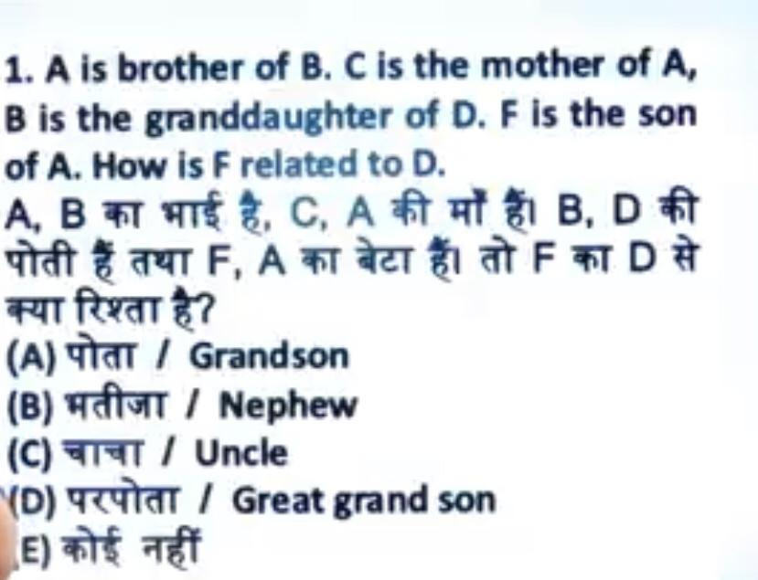

# IBPS PO

- Books
    - Pending
- Notes
    - Pending
- Sallybus
    - Done

# Blood Relationship

## Questions
## Q1

Hindi: Suresh ne photo ki trf Ungli uthke kha, "Wo mere mata ke son ka kevl 1 hi son h", to Suresh uss ldke se kaise relation me h?

English: Pointing to a photograph of a boy Suresh said, "He is the son of, the only son of my mother." How is Suresh related to that boy?
A.	Brother
B.	Uncle
C.	Cousin
D.	Father
Ans: A

|Name|Answer|Reason|
|-|-|-|
|Suresh| D| my Mother -> beta (Mama) -> only beta (Brother)|
|Ravi Ji |D| Mata -> beta(Me) -> only Beta (son) | 
| Rinky| D| Mata -> beta(Me) -> only Beta (son) |

## Q2

A is brother -> B 

C is mother -> A is brother -> B is Poti -> D
B is Poti -> D

F is son -> A

|Name|Answer|Reason|
|-|-|-|
|Suresh| D| |
|Ravi Ji |D| | 
| Rinky| D| |

## Q3

|Name|Answer|Reason|
|-|-|-|
|Suresh| 4| |
|Ravi Ji |4| | 
| Rinky| 4| |

## Q4

Answer: 4

